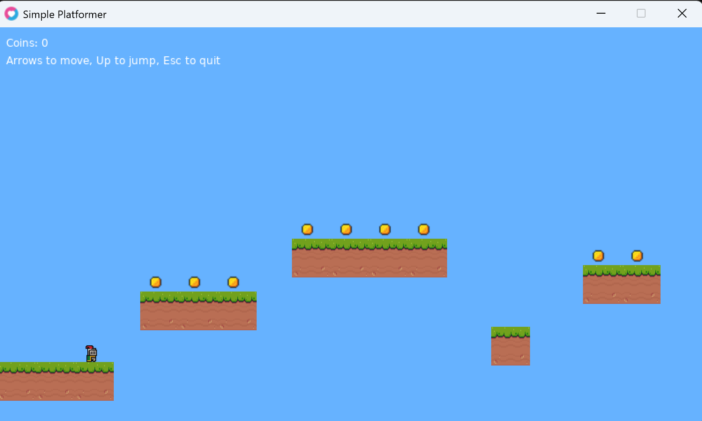

## RC LÖVE2D Platformer



Small learning project built at the [Recurse Center](https://www.recurse.com/) with [LÖVE2D](https://love2d.org/) to explore the engine. It features a player that can jump over platforms in order to collect coins, when the player falls off the map it respawn at the initial position and the coins are reset. This game includes basic gravity and platform collision (landing on top of platforms).

### Running the game

Clone the repo:
```
git clone https://github.com/nadia-nh/rc-love2d-platformer.git
cd rc-love2d-platformer
```

Run with LÖVE:

1. From inside the folder
```
  love ./
```
2. Point LÖVE at this folder
```
  love <path-to-folder>\rc-love2d-platformer\
```

Controls:
- Left / right arrow keys – Move
- Up – Jump
- Esc – Quit

### How the game works

The main [callback functions in LÖVE](https://love2d.org/wiki/Tutorial:Callback_Functions) are :
- `love.load()`- Runs once at the beginning, used for loading images and setting up the world
- `love.update(dt)` - Runs every frame, used for moving the player, applying gravity, handling collisions, respawns, and coin pickups
- `love.draw()` - Runs every frame after update, used for drawing the background, platforms, coins, and player

The logic is organized into a few small files:
- *`main.lua`* - Ties everything together, calls module functions, handles the main loop
- *`player.lua`* - Handles player movement, gravity, jumping, respawn
- *`platforms.lua`* - Contains the platform list, handles collisions between the player and the platforms
- *`coins.lua`* - 
  Contains coin positions, handles coin pickup logic

### Reference

- [Sheepolution Löve2D Tutorial](https://www.sheepolution.com/learn/book/contents) - For platformer creation guide and collision logic
- [Brackeys Games Platformer Bundle](https://brackeysgames.itch.io/brackeys-platformer-bundle) - For player, coin, and platform assets
